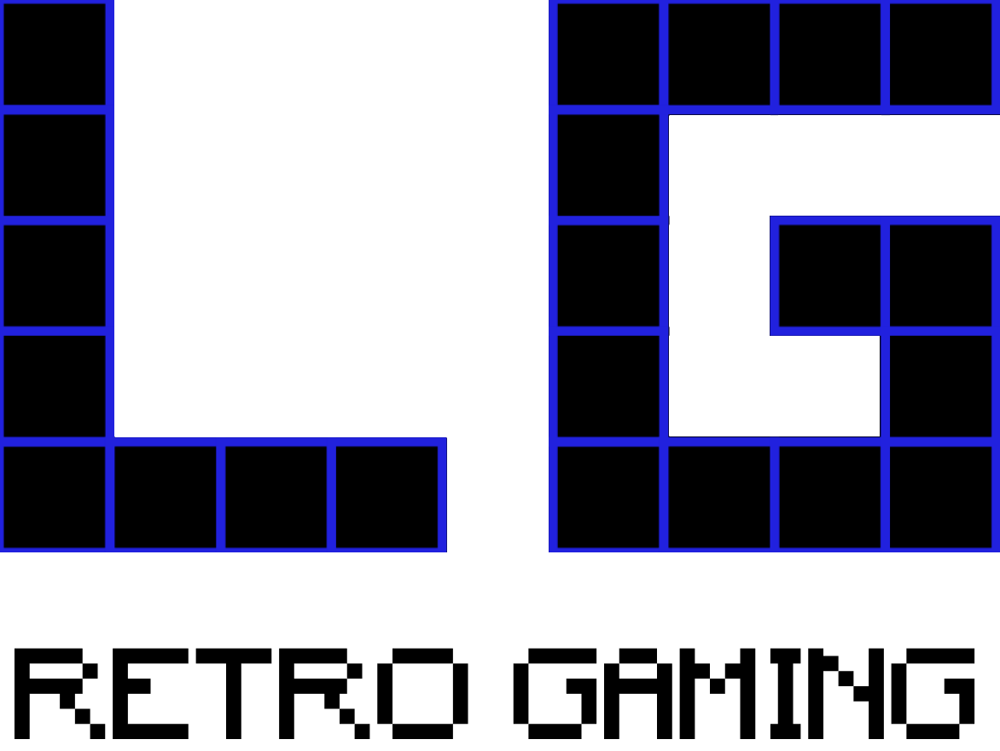
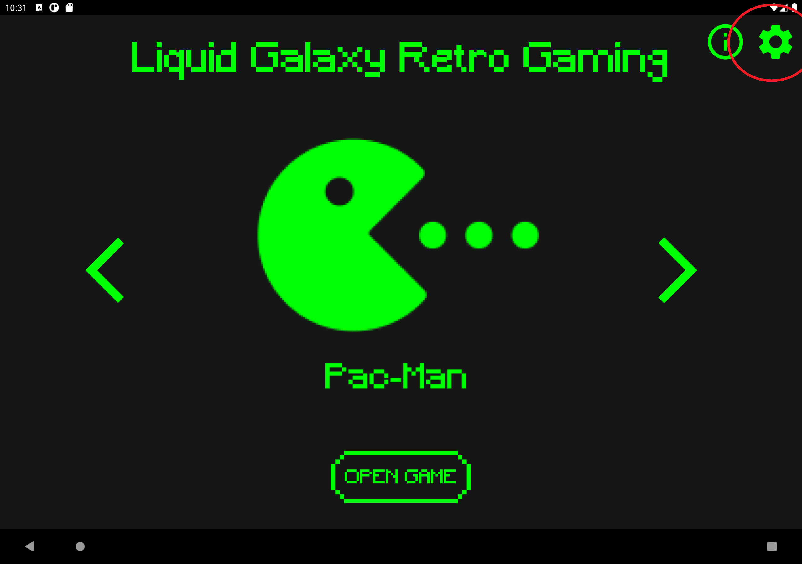
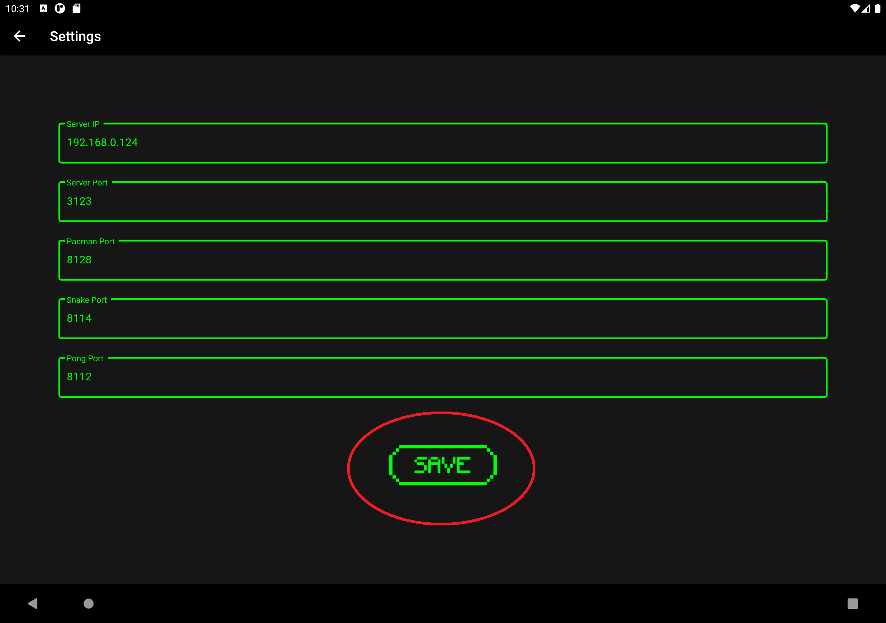

[](https://opensource.org/licenses/Apache-2.0) []() []() [](https://github.com/LiquidGalaxyLAB/lg-retro-gaming/issues) []() []()

# 🕹️ Liquid Galaxy Retro Gaming

<p align="center">

</p>

The Liquid Galaxy Retro Gaming is an app created with the intention of making the management of games in the Liquid Galaxy easier for any user. By simply installing the games and the LGRG server on your Liquid Galaxy master you can quickly launch and stop games on all screens and also get access to a specific controller for the chosen game and a QR code for other players to easily access the controller as well!

## 📝 Before Running

1. Make sure the Liquid Galaxy core is installed, more info about the installation can be found on this [repository](https://github.com/LiquidGalaxyLAB/liquid-galaxy)
2. Make sure **Node.js version 14** is installed on the master machine by running:

```bash
node -v
```

3. The output should look someting like `v14.17.5`, if this is not the case use the following link for tips on how to install it:
   [How To Install Node.js on Ubuntu 16.04](https://tecadmin.net/install-latest-nodejs-npm-on-ubuntu/)
4. After Node.js is installed, Install pm2 on master machine. Run command:

```bash
sudo npm i -g pm2
```

5. Make sure all the other games are installed on the Liquid Galaxy. The current games repositories can be found at:
   - [Galaxy Asteroids Repository](https://github.com/LiquidGalaxyLAB/galaxy-asteroids)
   - [Galaxy Pacman Repository](https://github.com/LiquidGalaxyLAB/galaxy-pacman)
   - [Galaxy Snake Repository](https://github.com/LiquidGalaxyLAB/galaxy-snake)
   - [Galaxy Pong Repository](https://github.com/LiquidGalaxyLAB/galaxy-pong)

## 👨‍💻 Installing The Project

Firstly, open a new terminal and go to the default terminal directory with the command:

```bash
cd
```

Now, clone the repository **in the home directory (default directory on terminal)** of the master machine with the command:

```bash
git clone https://github.com/LiquidGalaxyLAB/lg-retro-gaming.git
```

Once the repository is cloned, navigate to the cloned folder and execute the installation script by running the following commands:

```bash
cd lg-retro-gaming

bash install.sh {password}
```

> _The {password} is the rig password._

Once the installation is finished, make sure to reboot the machine.

If you experience any problems, check the installation logs for any possible errors in the logs folder, there will be a file with the date of installation as it's name.

## 📱 App setup

Now that the server is running, make sure the android device and the liquid galaxy are connected to the **same wi-fi** network berfore running the app. Once that's done, the setup is very simple.

- First, open the app and go to the settings page (cog icon on the top right of the screen)
<p align="center">

</p>

- On the settings screens set all the variables to the following values
  - Server Ip: Master machine ipv4 (including the dots e.g.: 192.168.0.124)
  - Server Port: 3123
  - Asteroids Port: 8129
  - Pacman Port: 8128
  - Snake Port: 8114
  - Pong Port: 8112
- Once all the values are set, click the “Save” button on the bottom of the screen.
<p align="center">

</p>

- The app is now ready to be used!

## 📃 License

This software is under the [MIT License](https://en.wikipedia.org/wiki/MIT_License)

Copyright 2022 [Leonardo Coelho Ruas](https://www.linkedin.com/in/leonardo-ruas/) - [Michell Algarra Barros](https://www.linkedin.com/in/mchalgarra/) 
